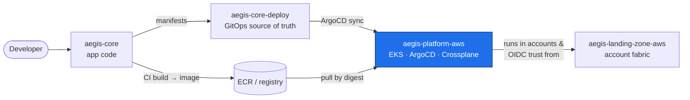
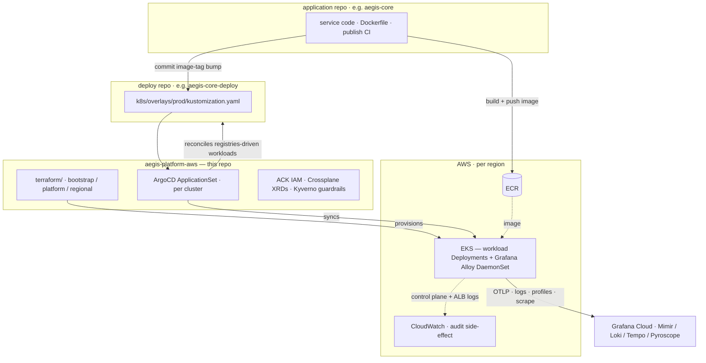
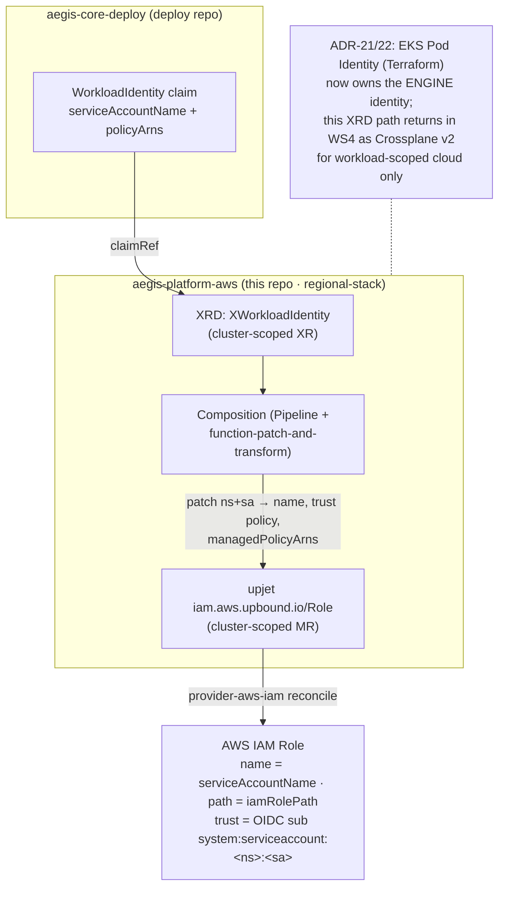
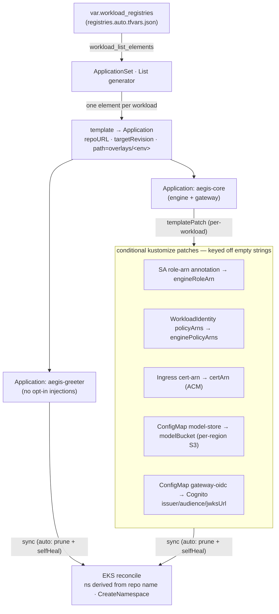
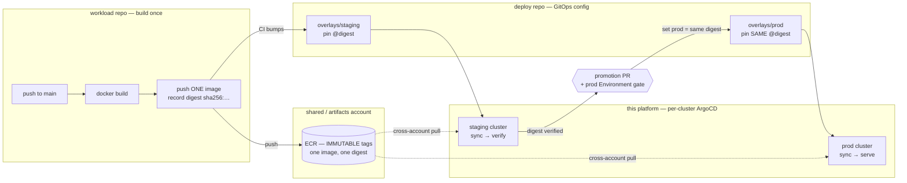

# aegis-platform-aws — the platform tier: EKS substrate, per-cluster ArgoCD, Crossplane, observability

The platform tier for a fleet of Kubernetes workloads on AWS — Terraform for the
cloud substrate, per-cluster ArgoCD for in-cluster GitOps, Crossplane for
workload-scoped cloud identity, Grafana Cloud for observability, and a DR drill
that rebuilds a region from git.

`aegis-platform-aws` is shared infrastructure. It provisions the EKS clusters and
runs the ArgoCD that reconciles **workload deploy repos** onto them. It owns no
application code and no Kubernetes manifests — those live in their own repos.

## The Aegis portfolio (4 repos)

| Tier | Repo | Role |
|------|------|------|
| Account fabric | [`aegis-landing-zone-aws`](https://github.com/BinHsu/aegis-landing-zone-aws) | AWS Organizations, OIDC trust anchor, SCPs |
| Platform | [`aegis-platform-aws`](https://github.com/BinHsu/aegis-platform-aws) | Terraform substrate (EKS/VPC), ArgoCD, Crossplane XRDs, observability |
| Application | [`aegis-core`](https://github.com/BinHsu/aegis-core) | The service — gateway + C++ engine + web frontend |
| Deploy (GitOps) | [`aegis-core-deploy`](https://github.com/BinHsu/aegis-core-deploy) | Kustomize + Crossplane claims; ArgoCD syncs from here |

> **You are here: `aegis-platform-aws`.**



## What this is & who it's for

This repo owns the paved road — EKS, ArgoCD, ACK, Crossplane XRDs, Kyverno
guardrails — and nothing application-specific. Workloads live in their own pairs of
repos and onboard themselves:

- **Application repos** (e.g. `aegis-core`) — service code, Dockerfile, and the CI
  that builds and publishes the container image.
- **Deploy repos** (e.g. `aegis-core-deploy`) — the Kubernetes manifests and
  Crossplane claims for one workload. ArgoCD watches these.

A workload onboards by getting one `registries` entry (ADR-07); ArgoCD's
`ApplicationSet` then renders an `Application` for it — no edit to this repo. The
platform owns the paved road; each deploy repo owns its own manifests and IAM
intent.

| You want to… | Start here |
|---|---|
| Understand the architecture | [Architecture](#architecture) below, then [`docs/adr/`](docs/adr/README.md) |
| See how a workload syncs | [Key flow](#key-flow) below — the ArgoCD + Crossplane diagrams |
| Read the reasoning behind a decision | [`docs/adr/README.md`](docs/adr/README.md) — ADR index with a reading order per audience |
| Stand it up from scratch | [Quick start / first-time setup](#quick-start--first-time-setup) below |
| Operate it day-to-day | [Day-to-day operations](#day-to-day-operations) below + [`docs/runbooks/`](docs/runbooks/) |
| Step through a real bring-up / go-live | [`docs/runbooks/`](docs/runbooks/) — bring-up, dual-region verification, prod go-live execution |
| See what's monitored and alerted on | [`docs/metrics-and-alerts.md`](docs/metrics-and-alerts.md) — panel + alert catalog |
| Run / understand the DR drill | [`docs/dr-plan.md`](docs/dr-plan.md) + [DR drill](#dr-drill) below |
| Know what it costs to run | [`docs/finops.md`](docs/finops.md) — cost model + the ephemeral-destroy strategy |
| See what was deliberately deferred | [`docs/tradeoffs.md`](docs/tradeoffs.md) |
| Read the lessons from the last live run | [`RETRO-ws3-staging-e2e-2026-06-18.md`](RETRO-ws3-staging-e2e-2026-06-18.md) — staging E2E retrospective |

## Architecture



- **Terraform**, three lifecycle-separated environments: `bootstrap` (state
  backend + CI roles), `platform` (slow lifecycle — Route 53, ECR, OIDC, budgets,
  Grafana dashboards), `regional` (fast lifecycle — VPC + EKS + ArgoCD + Alloy,
  applied once per region).
- **Multi-region topology as data** — the region set is data
  (`regions.auto.tfvars.json`), not code. Adding a region is a one-line data
  change; an external loop (Makefile / GitHub Actions matrix) applies `regional`
  once per region with per-region state isolation.
- **Workloads enrol via the registries map** (ADR-07) — there is no catalog.
  ArgoCD's `ApplicationSet` is driven by a List generator whose elements come from
  `var.workload_registries`; a workload enrols by getting a registries entry. (The
  SCM-provider generator was dropped: `GET /orgs/<owner>/repos` 404s on a personal
  GitHub account — caught live on the 2026-06-12 prod proof cluster.) The safety
  floor that makes self-service safe is the enforcement four-pack: AppProject
  destination-allowlist + ApplicationSet namespace-derivation, Kyverno
  (trust-subject↔namespace, default-deny NetworkPolicy baseline), and the
  org-level `deny-iam-privilege-escalation` SCP.
- **Workload IAM is self-owned** (ADR-07/09) — a deploy repo declares its identity
  intent as a Crossplane `WorkloadIdentity` claim; the platform's Composition
  renders the IAM role. As of ADR-21/22, **EKS Pod Identity now owns the engine's
  identity** (Terraform-managed) so it tears down cleanly; Crossplane returns in
  WS4 (v2) for workload-scoped cloud only. The platform tier owns no per-workload
  IAM by hand.
- **ArgoCD per cluster** — each EKS cluster runs its own ArgoCD, eliminating a
  GitOps-layer single point of failure. Deploy repos are public, so ArgoCD clones
  them anonymously over HTTPS — no per-workload deploy keys.
- **Observability** — workloads emit OpenTelemetry + Pyroscope to a node-local
  Grafana Alloy DaemonSet, which forwards to Grafana Cloud. CloudWatch is kept
  only for EKS control-plane logs + ALB access logs (audit side-effect).

See [`docs/adr/`](docs/adr/README.md) for the reasoning behind each decision and
[`docs/tradeoffs.md`](docs/tradeoffs.md) for what was deliberately deferred.

### Workload-identity chain (Crossplane XRD → IAM)

A deploy repo declares *intent* — which ServiceAccount needs a role, and optionally
which managed policies — and the platform renders the AWS IAM. The trust subject is
derived from the claim's own namespace, so a claim cannot forge a foreign-namespace
trust (ADR-09).



## Key flow

### How a workload syncs — ApplicationSet fan-out

One ArgoCD `ApplicationSet`, a single List generator, renders one `Application` per
workload. Account-bound values a public deploy repo must not hardcode are injected
per workload via the `templatePatch` — only for workloads that opt in (greeter
declares none, so it renders nothing).



The region (`aegis.binhsu.org/region`) and the ECR repository
(`aegis.binhsu.org/ecr-repository`) ride a generic `commonAnnotations` channel the
cluster owns; the deploy repo's own kustomize replacements apply them, so the
platform never learns a workload's internal deployment/container names (ADR-12, -16).

## Release model

How a workload image reaches production: **build once, promote the immutable
artifact by digest, serve every environment from one registry.** A rebuilt image
— even from the same git sha — is not provably the image staging verified, so prod
never rebuilds; it runs the exact digest staging passed. Full reasoning in
[ADR-10](docs/adr/10-release-model-build-once-promote-by-digest.md).



- **Build once** — the workload repo builds and pushes one image on merge to its
  `main`, recording the digest; ECR tags are `IMMUTABLE`.
- **One registry** — a neutral shared/artifacts account holds the image; every
  cluster (staging, prod, each region) pulls it cross-account. High-isolation
  estates may instead replicate per account — same digest, different topology.
- **Promote by digest** — staging verifies a digest; a promotion PR copies *that*
  digest into the prod overlay. No rebuild, no re-push.
- **Prod trigger** — the promotion PR's merge, gated by branch protection plus a
  GitHub `prod` Environment; prod ArgoCD auto-syncs the merged digest. Git is the
  audit record of what prod runs.
- **Config holds the difference** — replicas, limits, hostnames, role trust live
  in deploy-repo overlays + per-cluster injected params; the artifact is
  environment-agnostic. Credentials and ARNs are per-account; the artifact is not.

## Repository layout

```
regions.auto.tfvars.json    Region topology — platform_region + regions{}
registries.auto.tfvars.json Per-workload ECR/IRSA params (gitignored; account IDs). The workload roster — the List generator enumerates from here. See *.example
terraform/
  envs/bootstrap/           S3 state bucket + CI roles (local state, one-shot)
  envs/platform/            Route 53, ECR, OIDC, budget, SSM, Grafana, branch protection
  envs/regional/            VPC + EKS + ArgoCD + Alloy — applied once per region
  modules/regional-stack/   The per-region stack, invoked by envs/regional/
    charts/aegis-xrds/       Crossplane XRD + Composition (WorkloadIdentity → IAM)
grafana/dashboards/         Dashboard JSON, applied by the grafana/grafana TF provider
.github/workflows/          infra-plan, infra-apply, infra-ops
docs/adr/                   Architecture Decision Records
docs/runbooks/              Bring-up, dual-region verification, prod go-live execution
docs/tradeoffs.md           Deferred work + production-hardening path
Makefile                    Local dev + emergency apply (CI is the canonical path)
scripts/install-tools.sh    Pinned project-local toolchain → ./bin/
```

## Prerequisites

- An AWS account with permission to create VPC / EKS / IAM / ECR / Route 53 / S3.
- A Grafana Cloud stack (free tier is sufficient).
- `terraform` ≥ 1.11 (`.terraform-version` pins 1.14.8 for `tfenv`/`tenv`).
- `make`, `git`, `bash`, `aws` CLI, `kubectl`, `gh` (GitHub CLI — used to set
  the Actions secrets/variables during setup). All other tools (tflint, trivy,
  jq, gitleaks) install into `./bin/` via `make dev-setup`.

## Quick start / first-time setup

The CI pipeline cannot create the very infrastructure it authenticates against,
so the foundation is bootstrapped once from an operator's machine; CI takes over
after that. For a narrated, step-by-step walkthrough of a real bring-up, see
[`docs/runbooks/ws3-bring-up.md`](docs/runbooks/ws3-bring-up.md).

```bash
# 1. Project-local toolchain → ./bin/ + wire the pre-commit hook.
make dev-setup

# 2. Fill in secrets (templates ship as *.example):
cp terraform/envs/platform/secrets.auto.tfvars.example terraform/envs/platform/secrets.auto.tfvars
cp terraform/envs/regional/secrets.auto.tfvars.example terraform/envs/regional/secrets.auto.tfvars
# …edit both with real Grafana Cloud + GitHub PAT values (gitignored).

# 3. Pick the regions — regions.auto.tfvars.json is the single source of
#    truth, with two keys:
#      platform_region — where the Terraform state bucket and the slow-
#        lifecycle platform layer live (ECR, OIDC, Route 53, budget, SSM).
#        Set once; it is also the state-bucket region.
#      regions{}       — which region(s) the clusters deploy to. eu-central-1
#        and eu-west-1 both ship `enabled: true`; flip a region's `enabled`
#        flag to add or drop one.

# 4. Register workloads — there is no catalog. Add one entry per workload to
#    registries.auto.tfvars.json (copy from the *.example; gitignored, since it
#    holds account IDs). The List generator enumerates from this file.
cp registries.auto.tfvars.json.example registries.auto.tfvars.json  # then edit

# 5. Create the remote state backend + CI roles (local state, one-shot).
export AWS_PROFILE=<your-profile>
make bootstrap

# 6. Apply the slow-lifecycle platform env.
make platform

# 7. Apply the clusters, looping over every enabled region.
make regional
```

After `make platform`, capture its outputs and finish the CI wiring:

```bash
# GitHub Actions secrets — the authoritative list and the full `gh secret set`
# commands live in terraform/envs/platform/README.md (each value is piped from
# `terraform output`, so nothing is typed by hand).

# GitHub Actions repo variables for an application repo, from platform outputs:
gh variable set ECR_REPO_URL  -b "$(terraform -chdir=terraform/envs/platform output -raw ecr_repository_url)"  --repo BinHsu/aegis-greeter
gh variable set ECR_REGISTRY  -b "$(terraform -chdir=terraform/envs/platform output -raw ecr_registry)"        --repo BinHsu/aegis-greeter
gh variable set OIDC_ROLE_ARN -b "$(terraform -chdir=terraform/envs/platform output -raw greeter_ci_role_arn)" --repo BinHsu/aegis-greeter
gh variable set AWS_REGION    -b "$(terraform -chdir=terraform/envs/platform output -raw aws_region)"          --repo BinHsu/aegis-greeter

# Flip the CI bootstrap gate — infra-plan/infra-apply plan/apply jobs un-skip.
gh variable set BOOTSTRAP_COMPLETE -b "true" --repo BinHsu/aegis-platform-aws
```

### Publish the first workload image — cross-repo step

`make regional` brings up the cluster and ArgoCD, but a workload's Deployment
references an image that does not exist yet — its pods sit in `ImagePullBackOff`
until the workload's **application repo** publishes one. That repo's CI builds
the image, pushes it to the ECR repository provisioned here, and commits the
image-tag bump to its **deploy repo's** `k8s/overlays/prod/kustomization.yaml`.
ArgoCD then reconciles the new tag and the pods reach `Running`.

### Verify

```bash
aws eks update-kubeconfig --name aegis-platform-aws-eu-central-1 --region eu-central-1
kubectl get applications -n argocd   # one Application per workload, Synced + Healthy
kubectl get pods -n argocd           # ArgoCD healthy
kubectl get pods -n monitoring       # Alloy + node-exporter + kube-state-metrics
```

From here, every push to `main` runs `infra-plan` (PR) / `infra-apply`
(merge); see [CI/CD](#cicd) below. For dual-region and prod-specific verification,
see [`docs/runbooks/ws3-prod-dual-region-verification.md`](docs/runbooks/ws3-prod-dual-region-verification.md).

## Day-to-day operations

```bash
make help          # list every target
make fmt           # terraform fmt -recursive
make validate      # terraform validate, all envs
make lint          # tflint
make sec           # trivy config (MEDIUM+)
make platform      # apply the platform env
make regional      # apply every enabled region
make regional-one REGION=eu-central-1   # apply a single region
```

The pre-commit hook (`.githooks/pre-commit`, wired by `make dev-setup`) runs
`terraform fmt -check` + a `gitleaks` secret scan on every commit.

Operational procedures — bring-up, dual-region verification, prod go-live
execution, and the joint-strike patterns — are in
[`docs/runbooks/`](docs/runbooks/). Postmortems live in
[`docs/postmortems/`](docs/postmortems/), and the most recent live-run lessons in
[`RETRO-ws3-staging-e2e-2026-06-18.md`](RETRO-ws3-staging-e2e-2026-06-18.md).

## Decisions & trade-offs

The reasoning behind each architectural choice is recorded as a thematic
Architecture Decision Record. The index — with a reading order per audience
(platform reviewer, DR, security, observability) — is in
[`docs/adr/README.md`](docs/adr/README.md). What was deliberately deferred, and the
path to production hardening, is in [`docs/tradeoffs.md`](docs/tradeoffs.md).

## Cost

| Scope | Rate | Note |
|---|---|---|
| Per region | ~$0.20/hr | EKS control plane + Spot nodes + ALB + NAT gateway |
| Platform env | ~$0/mo | Route 53 zone + ECR storage — safe to leave running |
| Per DR drill | ~$1–2 | ~6 h: stand up → drill → destroy |

Regional infrastructure is **ephemeral** — stood up for a demo or DR drill, torn
down when idle (`make destroy-region`). The `bootstrap`/`platform`/`regional`
lifecycle split keeps this safe: a destroy never touches ECR images, the
Route 53 zone, or Grafana dashboards. An AWS Budget ($10 warn / $25 hard)
backstops a forgotten destroy. Cost scales linearly per region.

Full breakdown — itemised rates, the interval math, and the levers pulled — in
[`docs/finops.md`](docs/finops.md).

## DR drill

The drill proves a workload is reconstructible from git — Terraform state is
the source of truth, ArgoCD converges the cluster from zero. The failure-mode
matrix, RTO/RPO targets, and the full procedure are in
[`docs/dr-plan.md`](docs/dr-plan.md).

Run it with the helper script — it sequences the phases, times each, captures
CLI evidence, and writes a timestamped report under
[`docs/evidence/`](docs/evidence/README.md) (no drill artifacts are committed yet;
that README explains how to reproduce them):

```bash
scripts/dr/dr-drill.sh eu-central-1
```

Or step through it manually:

```bash
# Tear down one region's workload. The platform env (Route 53, ECR, Grafana
# dashboards) is untouched; other regions, if any, stay alive.
make destroy-region REGION=eu-central-1

# Rebuild it. EKS cold-provisioning dominates the cycle.
make regional-one REGION=eu-central-1

# Verify the workloads reconverged from git.
kubectl get applications -n argocd
```

Or run it through GitHub Actions: the `infra-ops` workflow (`workflow_dispatch`)
exposes `destroy-region` as an operator-triggered, audit-logged operation.

The **cold-rebuild RTO target is ~20–30 min** — region down to workload pods
Ready. The Terraform re-apply dominates (EKS control-plane provisioning is the
variable bottleneck); the ArgoCD reconverge that follows is negligible. See
[ADR-05](docs/adr/05-disaster-recovery.md) for the attribution.

## Observability

Workloads emit metrics, traces, logs, and continuous profiles via OpenTelemetry +
Pyroscope to a node-local Grafana Alloy DaemonSet, which forwards to Grafana
Cloud. Dashboards and alert rules are declared in Terraform
(`terraform/envs/platform/grafana.tf` + `grafana/dashboards/`) — no manual UI
edits, so the DR drill reconstructs them from git. The full panel and alert
inventory is in [`docs/metrics-and-alerts.md`](docs/metrics-and-alerts.md).

Sample queries (full set in [`docs/runbooks/observability-queries.md`](docs/runbooks/observability-queries.md)):

```promql
# request latency p95
histogram_quantile(0.95,
  sum by (le, route) (rate(http_server_request_duration_seconds_bucket{service_name="aegis-greeter"}[5m])))
```
```logql
# 5xx log lines in the last hour, by pod
sum by (pod) (count_over_time(
  {app="aegis-greeter"} | json | level="ERROR" | status >= 500 [1h]))
```

## CI/CD

| Workflow | Trigger | Does |
|---|---|---|
| `infra-plan` | PR / push to `main` | fmt, validate, tflint, trivy, gitleaks, `terraform plan` per env; posts the plan diff as a PR comment |
| `infra-apply` | push to `main` | `terraform apply` per env (platform + regional matrix) |
| `infra-ops` | `workflow_dispatch` | `bootstrap` / `destroy-region` / `destroy-platform` (the DR drill) |

`main` branch protection (required status checks + linear history + no
force-push) is provisioned by `github_branch_protection`, gated on
`var.enable_branch_protection` — GitHub requires Pro for branch protection on a
private repo, so it is off by default until the repo is public or on Pro (see
`docs/tradeoffs.md`). Two OIDC roles split trust — a read-only role for PR
plans, an apply role whose trust is pinned to `refs/heads/main`. Until the
`BOOTSTRAP_COMPLETE` repo variable is set, the plan/apply jobs skip cleanly (the
AWS foundation does not exist yet) and the pipeline stays green.

## License

MIT — see [`LICENSE`](LICENSE).
