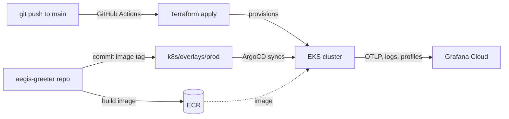

# Submission — aegis-stateless

The infrastructure half of a two-repo solution: a stateless HTTP greeter on
AWS EKS, provisioned by Terraform, delivered by ArgoCD GitOps, observed through
Grafana Cloud, and proven recoverable by a disaster-recovery drill.

## Status

Deployed to real AWS EKS and verified end to end — Terraform across three
environments, a live EKS cluster, ArgoCD reconciling the workload from git, and
the full OpenTelemetry → Alloy → Grafana Cloud pipeline confirmed carrying app
metrics, traces, logs, and profiles. The DR drill is scripted and its evidence
lands in [`evidence/`](evidence/README.md). The live environment is torn down after the
demo to bound cost — the proof is committed to git, not left running.

## Architecture

Full narrative in the [README](../README.md#architecture); the reasoning behind
each decision in [`adr/`](adr/README.md); deferred work in
[`tradeoffs.md`](tradeoffs.md).

## Service-level targets

Stated up front, because they frame every architectural choice.

| | Target | Basis |
|---|---|---|
| **RPO** | **~0 — N/A** | Stateless by design — no persistent data, nothing to lose. The metric a stateful system fights for is trivially satisfied here. |
| **RTO — cold rebuild** | **11m 21s** (measured) | The 2026-05-17 drill rebuilt a region from zero in 11m 21s ([`evidence/DR_REPORT.md`](evidence/DR_REPORT.md)) — to greeter pods Ready. ~20–30 min is the conservative budget (EKS control-plane provisioning is the variable bottleneck). Distinct from a *failover* RTO — see [ADR-05](adr/05-disaster-recovery.md). |
| **SLI** | request success rate, p95 latency | App-emitted over OpenTelemetry; the dashboard's RED panels. |
| **SLO** (posture) | 5xx < 5%, p95 < 1 s | The alert-rule thresholds — breaching them pages. |
| **SLA** | none committed | A reference build, not a contracted service. The posture supports the conversation; no number is promised. |

Detail and the failure-mode matrix: [`dr-plan.md`](dr-plan.md).

## Delivery format

A two-repo solution; the submission is two Git tags, each delivered as a zip
archive (`git archive` of the tag, or the GitHub release zip):

- **`aegis-stateless`** (this repo) — AWS infrastructure, Kubernetes manifests,
  ArgoCD, CI/CD, the DR drill.
- **`aegis-greeter`** (sibling) — the Go application, its Dockerfile, the
  image-publish CI.

## How to read this repo

Start with the [README's "Who is this for"](../README.md#who-is-this-for) table —
it routes a reviewer, an operator, and a forker to the right document.

## Anonymization

Everything tracked by git is treated as public. Committed files carry no
reviewer or company name, no personal email, and no AWS account ID or ARN —
with one structural exception. `k8s/overlays/prod/kustomization.yaml` pins the
greeter image by its full ECR URL, which embeds the account ID: an ECR
reference inherently contains it, and the GitOps image-tag commit-back flow
requires the committed manifest to carry the real reference. An account ID is
identity surface, not a credential, and the sandbox account is destroyed after
the demo. The exception is accepted and recorded — with the change path that
would keep it out of git — in [`tradeoffs.md`](tradeoffs.md). Other
placeholders (`example.com`, `123456789012`) stand in where a value must be
referenced. The remaining deliberate identity surfaces are the GitHub repo URL
and the Grafana Cloud stack slug — project codenames, not personal handles.
