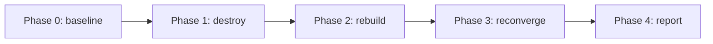

# Disaster recovery plan

How `aegis-platform` recovers from failure, what it targets, and how a drill
proves it. This is the *plan*; running `scripts/dr/dr-drill.sh` writes the
drill's timed evidence to `evidence/`.

## Scope

This plan covers the **workload tier** — the greeter Deployment and the regional
infrastructure that hosts it (VPC, EKS, ALB, ArgoCD, the Alloy collector). It
does **not** cover the `platform` environment (Route 53 zone, ECR, OIDC roles,
Grafana dashboards): that is slow-lifecycle, survives a regional destroy by
design, and is outside the drill's blast radius.

## Service-level targets

| | Target | Notes |
|---|---|---|
| **RPO** | **~0 — not applicable** | The greeter is **stateless by design**. It holds no persistent data; there is nothing to lose and nothing to restore. RPO — the metric a stateful system fights for — is trivially satisfied here, and that is the point of the stateless architecture. |
| **RTO — cold rebuild** | **~20–30 min (target)** | Reconstruct a region from zero — Terraform state + git, no warm standby, to greeter pods Ready. EKS control-plane provisioning is the variable bottleneck and dominates the budget. The recovery path for failures redundancy *cannot* cover (operator error; a bad change GitOps faithfully propagates). A *failover* RTO is a different, smaller number — see the matrix below. |
| **SLI** | request success rate, request latency p95 | Emitted by the app over OpenTelemetry; the dashboard's RED panels. |
| **SLO** (posture) | 5xx rate < 5%, p95 latency < 1 s | The alert-rule thresholds in `platform/grafana.tf` are the SLO line — breaching them pages. |
| **SLA** | none committed | A take-home reference build, not a contracted service. The architecture's posture supports an SLA conversation; no number is promised. |

## Failure modes and recovery

Recovery is layered — the cheaper the failure, the faster and more automatic
the recovery.

| Failure | Detection | Recovery | RTO |
|---|---|---|---|
| **Pod dies** | kubelet liveness probe | Kubernetes recreates the pod from the Deployment | seconds |
| **Node dies** | node controller | The managed node group replaces the node; pods reschedule | ~2–5 min |
| **AZ impaired** | ALB health checks | Surviving AZs absorb traffic; the Deployment's replicas span AZs | seconds–minutes, no operator action |
| **Region lost** | operator / external monitoring | **The drill scenario** — rebuild the region from IaC; ArgoCD reconverges the workload from git | **~20–30 min** (target) |
| **Multi-region failover** | Route 53 evaluates the ALB alias records' target health | Route 53 drops the unhealthy region's latency record; queries resolve to the surviving region | ~1–2 min (health detection + DNS TTL; not separately timed) |

Two regions are deployed (`eu-central-1` + `eu-west-1`), so a single region
loss is absorbed by the survivor while the lost region rebuilds. The
cold-rebuild RTO above is the recovery path for what redundancy *cannot*
absorb: a correlated failure — operator error, or a bad change GitOps
propagates to every region — or restoring the lost region itself.

## The drill — region rebuild

The region-loss scenario is the one the drill exercises: it is the only failure
mode that needs the IaC + GitOps recovery path proven end to end. The
pod / node / AZ cases are Kubernetes and AWS doing their job — observable, but
not "recovered" by this repo's code.

### Procedure

`scripts/dr/dr-drill.sh <region>` sequences and times it:

| Phase | Action | Timed |
|---|---|---|
| 0 — baseline | Confirm the cluster is healthy: greeter pods Ready. Record T0. | — |
| 1 — destroy | `make destroy-region REGION=<region>` — VPC, EKS, ALB, ArgoCD, Alloy, workload destroyed. The greeter is now down. | T0 → T1 |
| 2 — rebuild | `make regional-one REGION=<region>` — Terraform re-applies the regional stack. | T1 → T2 |
| 3 — reconverge | ArgoCD reinstalls, pulls each workload's deploy repo, syncs from its `k8s/overlays/prod/`. Poll until pods Ready. | T2 → T3 |
| 4 — report | Compute per-phase durations and total RTO (T3 − T1); write the report to `evidence/`. | — |

`make destroy-region` is destructive — the script requires explicit
confirmation before Phase 1.

### Cold-rebuild RTO breakdown

The cold-rebuild budget is **~20–30 min**, region-down to greeter pods Ready,
and it splits in two. The Terraform re-apply — VPC + EKS control plane + node
group + addons + ArgoCD + Alloy + external-dns — is the dominant cost; EKS
control-plane provisioning alone is the variable bottleneck. The ArgoCD
reconverge that follows is negligible by comparison: it pulls the deploy repos
and syncs the workloads in well under a minute. The budget stops at pods Ready
— ALB target health + DNS settle a few minutes after. See
[ADR-05](adr/05-disaster-recovery.md).

## Validation — evidence

A drill run is a claim until it is evidenced. `dr-drill.sh` writes a report and
a CLI log to `evidence/`. The operator pairs it with a Grafana dashboard
screenshot of the drill window.

The screenshot must be **committed into git** — the live dashboard is not
durable evidence: the cluster is destroyed after the drill, and Grafana Cloud's
free tier retains data only ~14 days, so the proof would otherwise be gone by
the time anyone looked. The evidence directory keeps it self-contained.
